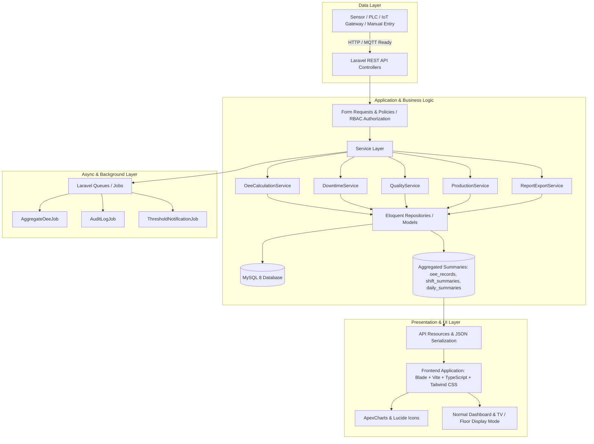

# Implementation Plan - OEE Performance System (OEE Sys)

OEE Sys is an enterprise-grade, scalable, and modular Overall Equipment Effectiveness (OEE) monitoring and analytics platform designed for manufacturing environments. It measures, analyzes, and visualizes plant effectiveness through Availability, Performance, and Quality metrics, while providing loss analysis (Six Big Losses), real-time machine status tracking, downtime management, quality tracking, and customizable dashboards (including a TV / Production Floor Mode).

---

## 1. System Architecture & High-Level Overview



### Architectural Principles:
1. **Decoupled Service Layer**: Business logic (especially complex mathematical calculations like OEE, MTTR, MTBF, Six Big Losses mapping) resides strictly in Services (`app/Services/Oee/...`), independent of HTTP controllers.
2. **Pre-aggregated OEE Summaries**: To ensure high performance on large-scale datasets, production metrics are aggregated at shift and daily intervals (`shift_summaries`, `daily_production_summaries`, `oee_records`).
3. **Enterprise RBAC**: Role-Based Access Control enforcing granular permissions (View, Create, Edit, Delete, Approve, Export, Master Data, User Mgmt) across 9 distinct user roles.
4. **IoT/PLC Integration Ready**: Machine event logs (`machine_events`, `machine_status_logs`, `downtime_events`) are decoupled from manual entry to easily accommodate future WebSocket/MQTT/OPC UA data ingestion.

---

## 2. Relational Database Schema & ERD

### Database Tables (Normalized MySQL 8 Schema)

#### Core & Access Control
- `users`: `id (BIGINT PK)`, `name`, `email`, `password`, `employee_id (FK null)`, `is_active (BOOLEAN)`, `remember_token`, `created_at`, `updated_at`, `deleted_at`
- `roles`: `id (BIGINT PK)`, `name (VARCHAR 50 UNIQUE)`, `display_name`, `description`, `created_at`, `updated_at`
- `permissions`: `id (BIGINT PK)`, `name (VARCHAR 100 UNIQUE)`, `module`, `description`, `created_at`, `updated_at`
- `role_user`: `user_id (FK)`, `role_id (FK)` (Composite PK)
- `permission_role`: `permission_id (FK)`, `role_id (FK)` (Composite PK)

#### Hierarchy & Plant Master Data
- `plants`: `id (BIGINT PK)`, `code (UNIQUE)`, `name`, `address`, `timezone`, `is_active`, timestamps, soft_deletes
- `areas`: `id (BIGINT PK)`, `plant_id (FK)`, `code`, `name`, `description`, is_active, timestamps, soft_deletes
- `departments`: `id (BIGINT PK)`, `plant_id (FK)`, `code`, `name`, timestamps, soft_deletes
- `production_lines`: `id (BIGINT PK)`, `area_id (FK)`, `code (UNIQUE)`, `name`, `target_oee (DECIMAL 5,2)`, is_active, timestamps, soft_deletes
- `work_centers`: `id (BIGINT PK)`, `production_line_id (FK)`, `code`, `name`, timestamps, soft_deletes
- `machine_types`: `id (BIGINT PK)`, `name`, `description`, timestamps
- `machines`: `id (BIGINT PK)`, `work_center_id (FK)`, `machine_type_id (FK)`, `code (UNIQUE)`, `name`, `serial_number`, `installation_date`, `status (ENUM: RUNNING, STOPPED, IDLE, BREAKDOWN, CHANGEOVER, MAINTENANCE, OFFLINE)`, `is_active`, timestamps, soft_deletes

#### Products & Process Master Data
- `product_categories`: `id (BIGINT PK)`, `name`, `description`, timestamps
- `products`: `id (BIGINT PK)`, `product_category_id (FK)`, `sku (UNIQUE)`, `name`, `unit_of_measure`, `ideal_cycle_time (DECIMAL 10,4)` *(in seconds per unit)*, timestamps, soft_deletes
- `processes`: `id (BIGINT PK)`, `code`, `name`, `description`, timestamps
- `machine_products`: `machine_id (FK)`, `product_id (FK)`, `process_id (FK)`, `specific_ideal_cycle_time (DECIMAL 10,4)`, PK(`machine_id`, `product_id`, `process_id`)

#### Shifts & Employees Master Data
- `shifts`: `id (BIGINT PK)`, `plant_id (FK)`, `name (e.g. Shift 1)`, `start_time (TIME)`, `end_time (TIME)`, `break_duration_minutes (INT)`, timestamps
- `employees`: `id (BIGINT PK)`, `department_id (FK)`, `nik (UNIQUE)`, `name`, `email`, `phone`, timestamps
- `operators`: `id (BIGINT PK)`, `employee_id (FK UNIQUE)`, `badge_number (UNIQUE)`, `skill_level`, timestamps

#### Downtime & Defect Taxonomies
- `downtime_categories`: `id (BIGINT PK)`, `code`, `name`, `is_planned (BOOLEAN)`, timestamps
- `downtime_reasons`: `id (BIGINT PK)`, `downtime_category_id (FK)`, `six_big_loss_category (ENUM: EQUIPMENT_FAILURE, SETUP_ADJUSTMENT, IDLING_MINOR_STOP, REDUCED_SPEED, PROCESS_DEFECTS, REDUCED_YIELD)`, `code`, `name`, `description`, timestamps
- `defect_categories`: `id (BIGINT PK)`, `code`, `name`, timestamps
- `defect_reasons`: `id (BIGINT PK)`, `defect_category_id (FK)`, `code`, `name`, timestamps

#### Production Execution & Operations
- `production_plans`: `id (BIGINT PK)`, `production_line_id (FK)`, `plan_number`, `start_date`, `end_date`, `status`, timestamps
- `production_orders`: `id (BIGINT PK)`, `production_plan_id (FK)`, `product_id (FK)`, `order_number (UNIQUE)`, `target_quantity (INT)`, `due_date`, `status`, timestamps
- `production_runs`: `id (BIGINT PK)`, `production_order_id (FK)`, `production_line_id (FK)`, `shift_id (FK)`, `run_date (DATE)`, `status`, timestamps
- `production_records`: 
  - `id (BIGINT PK)`
  - `production_order_id (FK)`
  - `production_line_id (FK)`
  - `machine_id (FK)`
  - `product_id (FK)`
  - `shift_id (FK)`
  - `operator_id (FK)`
  - `production_date (DATE)`
  - `planned_production_time (INT)` *(in minutes)*
  - `planned_downtime (INT)` *(in minutes)*
  - `available_production_time (INT)` *(in minutes)*
  - `run_time (INT)` *(in minutes)*
  - `downtime (INT)` *(in minutes)*
  - `idle_time (INT)` *(in minutes)*
  - `ideal_cycle_time (DECIMAL 10,4)` *(in seconds)*
  - `actual_cycle_time (DECIMAL 10,4)` *(in seconds)*
  - `target_quantity (INT)`
  - `total_quantity (INT)`
  - `good_quantity (INT)`
  - `reject_quantity (INT)`
  - `scrap_quantity (INT)`
  - `production_rate (DECIMAL 10,2)`
  - `status (ENUM: DRAFT, IN_PROGRESS, COMPLETED, CLOSED)`
  - timestamps, soft_deletes

#### Downtime Log & Quality Log
- `downtimes`:
  - `id (BIGINT PK)`
  - `production_record_id (FK)`
  - `machine_id (FK)`
  - `production_line_id (FK)`
  - `downtime_category_id (FK)`
  - `downtime_reason_id (FK)`
  - `start_time (DATETIME)`
  - `end_time (DATETIME null)`
  - `duration_minutes (DECIMAL 10,2)`
  - `description (TEXT null)`
  - `is_planned (BOOLEAN)`
  - `created_by (FK users)`
  - timestamps, soft_deletes
- `quality_records`:
  - `id (BIGINT PK)`
  - `production_record_id (FK)`
  - `machine_id (FK)`
  - `product_id (FK)`
  - `defect_category_id (FK null)`
  - `defect_reason_id (FK null)`
  - `total_quantity (INT)`
  - `good_quantity (INT)`
  - `reject_quantity (INT)`
  - `rework_quantity (INT)`
  - `scrap_quantity (INT)`
  - `inspection_time (DATETIME)`
  - `inspector_id (FK users)`
  - `notes (TEXT null)`
  - timestamps

#### OEE Aggregation & Reporting Summaries
- `oee_records`:
  - `id (BIGINT PK)`
  - `production_record_id (FK UNIQUE)`
  - `machine_id (FK)`
  - `production_line_id (FK)`
  - `shift_id (FK)`
  - `record_date (DATE)`
  - `availability (DECIMAL 8,4)` *(0.00 to 100.00)*
  - `performance (DECIMAL 8,4)`
  - `quality (DECIMAL 8,4)`
  - `oee (DECIMAL 8,4)`
  - `six_big_losses_summary (JSON)`
  - timestamps
- `shift_summaries`:
  - `id (BIGINT PK)`, `production_line_id (FK)`, `shift_id (FK)`, `summary_date (DATE)`
  - `total_target_qty`, `total_actual_qty`, `total_good_qty`, `total_reject_qty`
  - `availability (DECIMAL 8,4)`, `performance (DECIMAL 8,4)`, `quality (DECIMAL 8,4)`, `oee (DECIMAL 8,4)`
  - timestamps
- `daily_production_summaries`:
  - `id (BIGINT PK)`, `production_line_id (FK)`, `summary_date (DATE)`
  - `total_target_qty`, `total_actual_qty`, `total_good_qty`, `total_reject_qty`
  - `availability (DECIMAL 8,4)`, `performance (DECIMAL 8,4)`, `quality (DECIMAL 8,4)`, `oee (DECIMAL 8,4)`
  - timestamps

#### IoT & Real-time Architecture Foundation
- `machine_events`: `id (BIGINT PK)`, `machine_id (FK)`, `event_type (ENUM: RUN, STOP, IDLE, ALARM, DEFECT)`, `event_time (DATETIME)`, `payload (JSON)`, timestamps
- `machine_status_logs`: `id (BIGINT PK)`, `machine_id (FK)`, `status (VARCHAR 30)`, `started_at (DATETIME)`, `ended_at (DATETIME null)`, timestamps

#### System Infrastructure
- `audit_logs`: `id (BIGINT PK)`, `user_id (FK null)`, `action (VARCHAR 100)`, `module (VARCHAR 100)`, `record_id`, `old_value (JSON null)`, `new_value (JSON null)`, `ip_address`, timestamps
- `system_settings`: `id (BIGINT PK)`, `key (VARCHAR 100 UNIQUE)`, `value (TEXT)`, `group (VARCHAR 50)`, `description`, timestamps
- `notifications`: `id (CHAR 36 PK)`, `type`, `notifiable_type`, `notifiable_id`, `data (JSON)`, `read_at (DATETIME null)`, timestamps

---

## 3. Table Relationships Summary

- **Plant Structure**: `Plant (1) -> (*) Area (1) -> (*) ProductionLine (1) -> (*) WorkCenter (1) -> (*) Machine`.
- **Machine Setup**: `Machine` linked to `MachineType`. Many-to-many relationship with `Product` through `machine_products` specifying product-machine specific `ideal_cycle_time`.
- **Operational Execution**: `ProductionLine (1) -> (*) ProductionRun -> ProductionRecord`. `ProductionRecord` ties `Machine`, `Product`, `Shift`, and `Operator`.
- **Downtime & Quality Logs**: Each `ProductionRecord` owns multiple `Downtime` entries (linked to `DowntimeCategory`, `DowntimeReason`, and mapped to *Six Big Losses*) and multiple `QualityRecord` entries (linked to `DefectReason`).
- **OEE Engine Data**: `ProductionRecord` computes one `OeeRecord`. Pre-calculated aggregates populate `shift_summaries` and `daily_production_summaries` via background job triggers.

---

## 4. OEE Calculation Engine & Loss Analysis Flow

### Precise Formulas (No Intermediate Rounding)

1. **Planned Production Time ($PPT$)**:
   $$\text{PPT} = \text{Shift Duration} - \text{Planned Downtime (Breaks, Scheduled Maintenance)}$$

2. **Run Time ($RT$)**:
   $$\text{RT} = \text{PPT} - \text{Unplanned Downtime}$$

3. **Availability ($A$)**:
   $$\text{Availability (\%)} = \left(\frac{\text{Run Time}}{\text{Planned Production Time}}\right) \times 100$$
   *Edge Case Handling*: If $\text{PPT} \le 0$, $\text{Availability} = 0.00\%$.

4. **Performance ($P$)**:
   $$\text{Performance (\%)} = \left(\frac{\text{Ideal Cycle Time (sec/unit)} \times \text{Total Quantity Produced}}{\text{Run Time (seconds)}}\right) \times 100$$
   *Edge Case Handling*: If $\text{Run Time} \le 0$ or $\text{Total Quantity} = 0$, $\text{Performance} = 0.00\%$. Cap display / metrics as configured when overspeed occurs (or keep actual raw ratio up to 100%/120% per config).

5. **Quality ($Q$)**:
   $$\text{Quality (\%)} = \left(\frac{\text{Good Quantity}}{\text{Total Quantity Produced}}\right) \times 100$$
   *Edge Case Handling*: If $\text{Total Quantity} = 0$, $\text{Quality} = 100.00\%$ (or $0.00\%$ if no run occurred).

6. **Overall Equipment Effectiveness ($OEE$)**:
   $$\text{OEE (\%)} = \left(\frac{\text{Availability}}{100}\right) \times \left(\frac{\text{Performance}}{100}\right) \times \left(\frac{\text{Quality}}{100}\right) \times 100$$

7. **Six Big Losses Categorization**:
   - **Equipment Failure**: Unplanned breakdown downtime.
   - **Setup & Adjustment**: Changeover, tool replacement, setup time.
   - **Idling & Minor Stops**: Short stops (< 5 mins), jams, sensor misfires.
   - **Reduced Speed**: Loss time where $Actual Cycle Time > Ideal Cycle Time$.
   - **Process Defects**: Reject / rework quantity converted into equivalent lost time.
   - **Reduced Yield**: Scrap quantity produced during startup or run.

---

## 5. Module Structure

```
OEE_Sys/
├── app/
│   ├── Enums/
│   │   ├── MachineStatus.php
│   │   ├── SixBigLoss.php
│   │   └── PerformanceThreshold.php
│   ├── Http/
│   │   ├── Controllers/
│   │   │   ├── Api/
│   │   │   │   ├── AuthController.php
│   │   │   │   ├── DashboardController.php
│   │   │   │   ├── OeeController.php
│   │   │   │   ├── ProductionController.php
│   │   │   │   ├── DowntimeController.php
│   │   │   │   ├── QualityController.php
│   │   │   │   ├── MachineController.php
│   │   │   │   ├── ReportController.php
│   │   │   │   └── MasterDataControllers...
│   │   ├── Requests/
│   │   │   └── Production/...
│   │   └── Resources/
│   │       ├── OeeResource.php
│   │       ├── DashboardKpiResource.php
│   │       └── DowntimeResource.php
│   ├── Models/
│   │   ├── Plant.php, ProductionLine.php, Machine.php...
│   │   ├── ProductionRecord.php, Downtime.php, QualityRecord.php
│   │   └── OeeRecord.php, ShiftSummary.php, AuditLog.php
│   ├── Policies/
│   │   └── ProductionPolicy.php, MasterDataPolicy.php...
│   ├── Services/
│   │   ├── Oee/
│   │   │   ├── OeeCalculationService.php
│   │   │   ├── SixBigLossesService.php
│   │   │   └── OeeAggregationService.php
│   │   ├── Downtime/
│   │   │   └── DowntimeService.php
│   │   ├── Quality/
│   │   │   └── QualityService.php
│   │   └── Report/
│   │       └── ExportService.php
│   └── Jobs/
│       ├── CalculateOeeJob.php
│       └── GenerateDailySummaryJob.php
├── resources/
│   ├── js/
│   │   ├── components/
│   │   │   ├── common/ (KpiCard, StatusBadge, Modal, DataTable, DateRangePicker)
│   │   │   ├── charts/ (OeeTrendChart, ParetoChart, SixBigLossesChart, ShiftCompareChart)
│   │   │   ├── dashboard/ (FilterBar, MachineStatusGrid, TvModeOverlay)
│   │   │   └── forms/ (DowntimeFormModal, ProductionRecordModal)
│   │   ├── layouts/
│   │   │   ├── AppLayout.vue / Blade Layout
│   │   │   └── TvLayout.vue
│   │   ├── pages/
│   │   │   ├── Dashboard.vue / Blade Views
│   │   │   ├── ProductionMonitoring.vue
│   │   │   ├── MachinePerformance.vue
│   │   │   ├── DowntimeAnalysis.vue
│   │   │   ├── QualityPerformance.vue
│   │   │   ├── Reports.vue
│   │   │   └── MasterData/
│   │   ├── services/
│   │   │   └── api.ts
│   │   └── types/
│   │       └── oee.ts
│   ├── css/
│   │   └── app.css (Tailwind CSS custom directives)
│   └── views/
│       ├── app.blade.php
│       └── pdf/ (Report templates)
```

---

## 6. API Architecture & Endpoints

All responses follow a strict envelope:
```json
{
  "success": true,
  "message": "Data retrieved successfully",
  "data": { ... },
  "meta": { "pagination": { ... } }
}
```

### Core API Endpoints:
- `POST /api/v1/auth/login`, `POST /api/v1/auth/logout`, `GET /api/v1/auth/user`
- `GET /api/v1/dashboard/oee-kpi` *(QueryParams: plant_id, line_id, machine_id, shift_id, start_date, end_date)*
- `GET /api/v1/dashboard/oee-trend`
- `GET /api/v1/dashboard/six-big-losses`
- `GET /api/v1/dashboard/pareto-downtime`
- `GET /api/v1/dashboard/pareto-defects`
- `GET /api/v1/dashboard/machine-ranking`
- `GET /api/v1/dashboard/line-ranking`
- `GET /api/v1/dashboard/shift-comparison`
- `GET /api/v1/production-monitoring/realtime-status`
- `GET /api/v1/production-records`, `POST /api/v1/production-records`, `PUT /api/v1/production-records/{id}`
- `GET /api/v1/downtimes`, `POST /api/v1/downtimes`, `PUT /api/v1/downtimes/{id}`
- `GET /api/v1/quality-records`, `POST /api/v1/quality-records`
- `GET /api/v1/reports/export` *(type: pdf|excel|csv, report_kind: oee|production|downtime|quality)*
- Master Data CRUD: `/api/v1/master/plants`, `production-lines`, `machines`, `products`, `downtime-reasons`, `defect-reasons`, `shifts`, `users`

---

## 7. Frontend Architecture & Design System

### Visual Aesthetic & Theme:
- **Theme**: Dark / Sleek Industrial Enterprise UI (`slate-900` / `zinc-900` cards with high contrast text, vibrant status accents).
- **Status Semantic Color Palette**:
  - `Excellent (>= 85%)`: Emerald Green (`#10B981`)
  - `Good (75% - 84.99%)`: Blue / Cyan (`#06B6D4`)
  - `Warning (60% - 74.99%)`: Amber / Orange (`#F59E0B`)
  - `Critical (< 60%)`: Rose / Red (`#EF4444`)
- **Machine Status Indicators**:
  - `RUNNING`: Flashing Pulse Emerald
  - `STOPPED / BREAKDOWN`: Crimson Red
  - `IDLE`: Amber Yellow
  - `CHANGEOVER / MAINTENANCE`: Violet / Indigo

### Layout Modes:
1. **Normal Enterprise Dashboard**: Sidebar navigation, Topbar with filters & user actions, multi-card responsive grid.
2. **TV / Production Floor Mode**: Clean screen layout optimized for 1080p/4K plant screens, large font sizes, auto-rotating tabs/refresh (30s / 1m / 5m), high-contrast visual gauges.

---

## 8. Proposed Changes & Implementation Phases

### Phase 1: Project Foundation, Security & Master Data
- Initialize Laravel 11 / 12 application setup with PHP 8.3+, MySQL 8 database configuration.
- Implement Authentication & RBAC (Roles & Permissions with Policies & Middleware).
- Create Migrations, Models, Factories, and Seeders for Master Data (Plants, Lines, Machines, Products, Downtime/Defect Reasons, Shifts, Users).
- Build Master Data Management APIs & UI.

### Phase 2: Production Execution, Downtime & Quality Log Engine
- Implement `production_records`, `downtimes`, and `quality_records` database schema & Eloquent models.
- Build Form Request Validations & CRUD Services.
- Implement automatic downtime duration calculation (handling ongoing downtimes where `end_time` is `NULL`).

### Phase 3: OEE Calculation Service Engine & Unit Testing
- Implement `OeeCalculationService` (Availability, Performance, Quality, OEE, Six Big Losses mapping).
- Write comprehensive PHPUnit / Pest tests verifying mathematical precision, edge case zero-divisions, and threshold evaluators.
- Setup background jobs for aggregated metrics (`shift_summaries`, `daily_production_summaries`, `oee_records`).

### Phase 4: Main Dashboard & Visualization Suite
- Create Main OEE Performance Dashboard API endpoints.
- Build Frontend Dashboard using Vue 3 / Alpine / Blade components with ApexCharts & Lucide Icons.
- Implement OEE Trend, Pareto Downtime, Six Big Losses, Shift Performance, Line Ranking, Machine Ranking visual components.
- Implement global dynamic filter bar (Plant, Line, Machine, Shift, Date Range).

### Phase 5: Machine Performance, Production Lines & Shift Dashboards
- Build dedicated views:
  - Machine Performance Dashboard (with conditional formatting tables & status gauges).
  - Production Line Performance Dashboard.
  - Shift Comparison Performance Dashboard.
  - Downtime Analysis Dashboard (MTTR & MTBF metrics).
  - Quality Performance Dashboard.

### Phase 6: Production Floor TV Mode & Real-time Readiness
- Build TV / Production Floor fullscreen presentation mode with customizable auto-refresh polling (30s/1m/5m).
- Implement simulated real-time data stream generator for machine status & counts (`machine_events`, `machine_status_logs`).

### Phase 7: Reporting, Audit Logging & Notifications
- Implement export engine (Excel/CSV via PhpSpreadsheet / FastExcel, PDF via DomPDF / Snappy).
- Build Audit Logging middleware tracking sensitive modifications (e.g. cycle time changes, downtime edits).
- Build In-App Notification engine for low OEE & long breakdown alerts.

### Phase 8: Database Seeders, Verification & Documentation
- Execute comprehensive database seeder creating 30 days of realistic multi-plant, multi-line, multi-shift production history.
- Run full suite of automated tests & verify all visual dashboards.
- Generate user documentation and system README.

---

## 9. Verification Plan

### Automated Testing
- **Unit Tests**: `tests/Unit/OeeCalculationServiceTest.php`
  - Verify Availability, Performance, Quality, and OEE calculation logic.
  - Verify zero-division safeguards (`PPT = 0`, `Run Time = 0`, `Total Qty = 0`, `Ideal Cycle Time = 0`).
  - Verify Six Big Losses calculation.
  - Verify MTTR & MTBF logic.
- **Feature Tests**: `tests/Feature/ProductionRecordApiTest.php`, `tests/Feature/DashboardApiTest.php`
  - Verify RBAC endpoint permissions.
  - Verify database transaction integrity on production entries.

### Manual Verification
- Test interactive filter bar selections across all dashboards.
- Verify TV Floor display mode on 1080p resolution with auto-refresh enabled.
- Verify export generation for PDF, Excel, and CSV formats.
